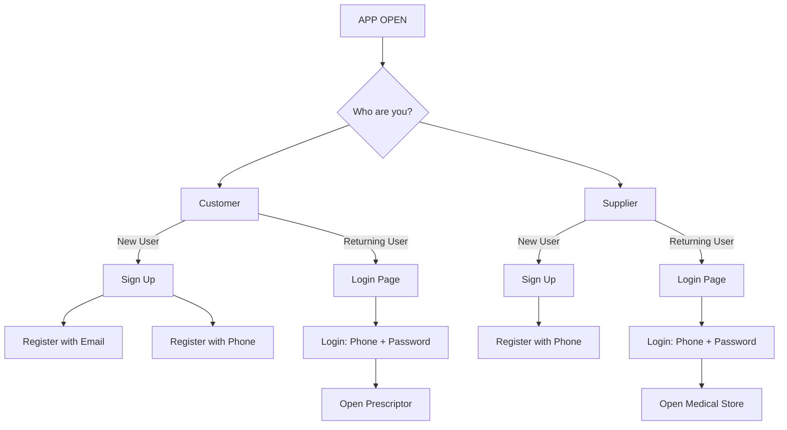

# 🔐 Login Module

This module handles authentication for both **Customers** and **Suppliers**.

## 📊 Login Flow

## 🔗 Navigation

- ➡️ [Go to Prescriptor Module](PRESCRIPTOR.md)
- ➡️ [Go to Medical Store Module](MEDICAL_STORE.md)
- 🏠 [Back to Home](README.md)