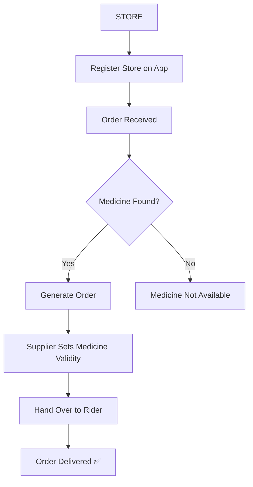

# 🏪 Medical Store Module

This module covers the store-side flow: receiving orders, checking stock, and delivering medicines.

## 📊 Store Order Flow

## 🔗 Navigation

- ➡️ [Go to Prescriptor Module](PRESCRIPTOR.md)
- 🔐 [Go to Login](LOGIN.md)
- 🏠 [Back to Home](README.md)