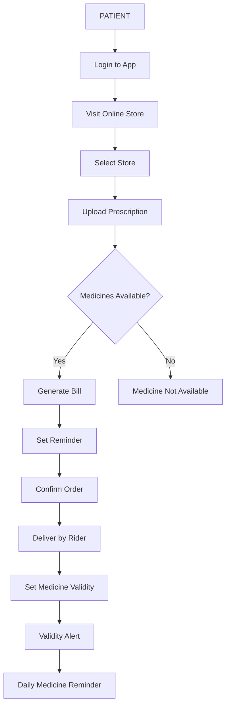

# 💊 Prescriptor Module

This module allows patients to upload prescriptions and order medicines from online stores.

## 📊 Patient Order Flow

## 🔗 Navigation

- ➡️ [Go to Medical Store Module](MEDICAL_STORE.md)
- 🔐 [Back to Login](LOGIN.md)
- 🏠 [Back to Home](README.md)