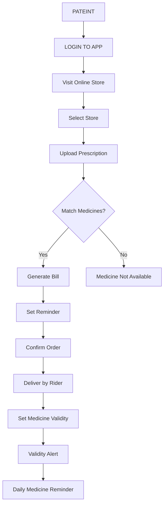

# 🏥 Patient Medical Store System

## 📊 Flowchart

```mermaid
flowchart TD
     Z[PATEINT]-->A[LOGIN TO APP]
    A --> B[Visit Online Store]
    B --> C[Select Store]
    C --> D[Upload Prescription]
    D --> E{Match Medicines?}

    E -- Yes --> F[Generate Bill]
    E -- No --> X[Medicine Not Available]

    F --> G[Set Reminder]
    G --> H[Confirm Order]
    H --> I[Deliver by Rider]
    I --> J[Set Medicine Validity]
    J --> K[Validity Alert]
    K --> L[Daily Medicine Reminder]
```
[OPEN LOGIN](LOGIN.MD)
    